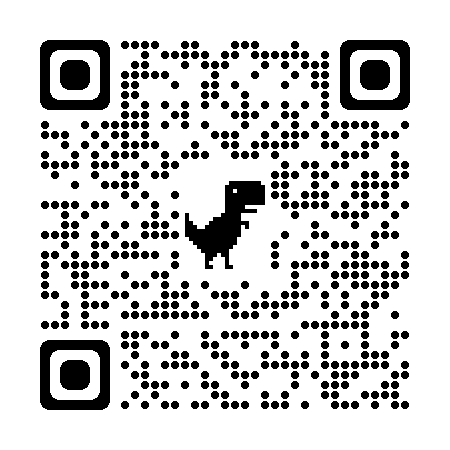
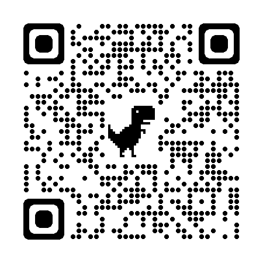

# peer_server
Peer-to-peer server based on WebSockets.

<h3>Selenika Video Chat</h3>
<h2>selenika2022.ru</h2>
<a href="https://selenika2022.ru">selenika2022.ru</a>

<h2>unstoppablemomentum</h2>
<a href="https://unstoppablemomentum.github.io">unstoppablemomentum.github.io</a>

